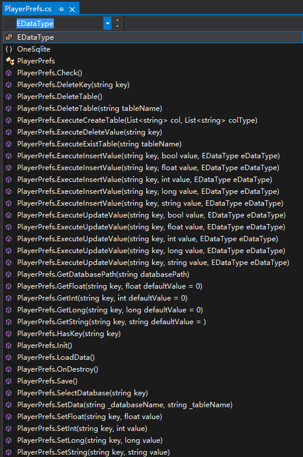
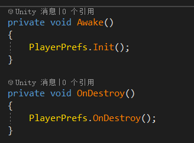

# Database storage solution under Unity--OneSqlite

[OneSqlite]( https://assetstore.unity.com/packages/slug/175529 
) is a data storage plugin under Unity, using Sqlite database to store data. Built-in a database storage method in the form of Key and Value consistent with PlayerPrefs under Unity. In general, the database is used by the server, and the client customizes the data storage format. However, as the functions of the game are becoming larger and larger, the data structure and storage methods are becoming more and more complex, and the simple Key and Value forms can no longer meet and have no needs. Therefore, the client database is introduced to store data more convenient. Of course, if the game content is not complicated and does not require too much storage content, it is also possible to directly use the PlayerPrefs that comes with Unity.


[OneSqlite]( https://assetstore.unity.com/packages/slug/175529 
)  Is a cross-platform database storage solution. Currently it supports Windows, Mac, Android, and IOS platforms. Since the open source Sqlite database is used, other platforms can be extended later.

## Features

- There is a built-in function to change the PlayerPrefs that comes with Unity to the Key and Value forms of database storage. 
- The database supports int, long, float, bool, string and other types.
- Supports the creation of custom databases, custom tables, database additions, deletions, changes, and other functions.
- Cross-platform: currently supports Windows, Mac, Android, IOS.
- Support expansion and modification.
- Contains all source code and sample scenes.
- Support Mono and IL2CPP

## PlayerPrefs



To use PlayerPrefs is very simple

```
PlayerPrefs.SetString(USERNAME, username);

PlayerPrefs.DeleteKey(USERNAME);
```

But remember to initialize Init before use.




## Mono and IL2CPP

If you want to support Mono and IL2CPP, you need to use the following three interface functions:

SqliteConnection：Used for database connection.

SqliteCommand: Used for statements such as database queries.

SqliteDataReader: Used for database reading function.

## Doc

[PDF](./Doc/README.pdf)

## Release 

### 1.0.0

Init release 

## Contact

More information can go to the website:   https://assetstore.unity.com/packages/slug/175529 

Email: 936496193@qq.com