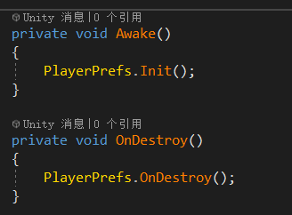

# Unity下数据库存储解决方案--OneSqlite

[OneSqlite]( https://assetstore.unity.com/packages/slug/175529 
) 是一个Unity下的数据存储插件，使用Sqlite数据库存储数据。内置一个Unity下的PlayerPrefs功能一致的Key、Value形式的数据库存储方式。一般情况下数据库都是服务器在使用，客户端自己自定义数据存储格式。但是随着现在游戏的功能越来越庞大，数据结构和存储方式越来越复杂，简单的Key、Value的形式已经无法满足也无需求，所以在引入客户端数据库是为了存储数据更加方便。当然如果游戏内容并不复杂，也不需要过多的存储内容，可以直接使用Unity自带的PlayerPrefs也是可以的。


[OneSqlite]( https://assetstore.unity.com/packages/slug/175529 
)  是一个跨平台的数据库存储解决方案。目前支持Windows、Mac、Android、IOS平台，由于使用的是开源的Sqlite数据库，后面也可以扩展其他平台。

## 特点

- 内置一个将Unity自带的PlayerPrefs改为数据库存储的Key、Value形式的功能。 
- 数据库支持 int、long、float、bool 、string等类型。
- 支持创建自定义数据库、自定义表格、数据库增删改查等功能。 
- 跨平台：目前支持Windows、Mac、Android、IOS。
- 支持扩展和修改。
- 包含所有的源代码和示例场景。
- 支持Mono和IL2CPP

## PlayerPrefs


要使用PlayerPrefs非常简单

```
PlayerPrefs.SetString(USERNAME, username);

PlayerPrefs.DeleteKey(USERNAME);
```

不过在使用之前记得Init初始化一下。




## Mono和IL2CPP

如果要支持Mono和IL2CPP，需要使用下面三个接口函数：

SqliteConnection：用于数据库连接。

SqliteCommand：用于数据库查询等语句。

SqliteDataReader：用于数据库读取功能。

## 文档

[PDF](./Doc/README.pdf)

## Release 版本

### 1.0.0

Init release 

## 联系

更多信息可以进入网站:   https://assetstore.unity.com/packages/slug/175529 

Email: 936496193@qq.com